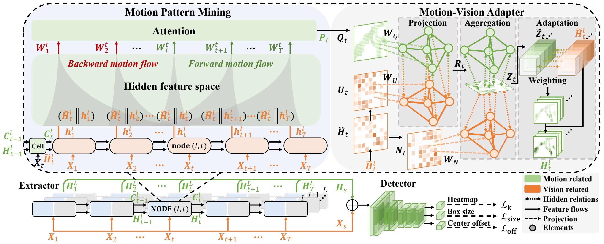

# MICML: Motion-Inspired Cross-Modal Learning for Small Object Detection in Satellite Videos



## Introduction
In small object detection, single modality can only provide a limited support to features learning. Most of prior methods mainly depend on a single vision modality to learn object features, seldom considering latent motion modality. However in real world, humans often efficiently perceive objects by multi-modal signals. Inspired by this observation, this paper attempts to tackle small object detection from a new prospective of latent modality learning. To fulfil this purpose, it regards a real-world moving object as the spatio-temporal sequences of a static object to capture latent motion modality. In view of this, we propose the motion-inspired cross-modal learning (MICML) scheme to capture motion modality, so as to adapt to moving small object scenarios. This scheme mainly consists of two crucial parts: motion pattern mining and motion-vision adapter. The former is designed to mine the motion pattern from time-dependent representation space. While the latter is devised to correlate between motion patterns and vision semantics. And then, we explore their cross-modal interactions to guide MICML to effectively capture motion modality.


## Datasets

- Satellite videos are available at [DSFNet](https://github.com/ChaoXiao12/Moving-object-detection-DSFNet) and [VISO](https://github.com/qingyonghu/viso).
- DroneCrowd dataset and baseline model: download from [DroneCrowd](https://github.com/VisDrone/DroneCrowd).


## Prerequisite
* Tested on Ubuntu 20.04, with Python 3.10, PyTorch 1.12, Torchvision 0.13.1, CUDA 11.3, and 2x NVIDIA 3080.
* You can follow [CenterNet](https://github.com/xingyizhou/CenterNet) to build the conda environment but remember to replace the DCNv2 used here with the used [DCNv2](https://github.com/CharlesShang/DCNv2/tree/pytorch_0.4) by CenterNet (Because we used the latested version of [DCNv2](https://github.com/CharlesShang/DCNv2)).
* You can also follow [CenterNet](https://github.com/xingyizhou/CenterNet) and [DSFNet](https://github.com/ChaoXiao12/Moving-object-detection-DSFNet) to build the conda environment with Python 3.7, PyTorch 1.7, Torchvision 0.8.1, CUDA 10.2 and run this code.


## Usage

### Train
```python
python train.py --model_name MICML \
		--gpus 0,1 \
		--lr 1.25e-4 \
		--lr_step 30,45 \
		--num_epochs 55 \
		--batch_size 2 \
		--val_intervals 5 \ 
		--test_large_size True \
		--datasetname  {dataset name} \
		--data_dir {dataset path}
```

### Test and visulization
```python
python test.py --model_name MICML \
               --gpus 0 \
               --load_model {checkpoint path} \
               --test_large_size True \
               --datasetname {dataset name} \
               --data_dir {dataset path}
```

### Evaluation
```python
python testSaveMat.py
```

```python
python evaluation.py
```


## Contact
If any questions, kindly contact with Shengjia Chen via e-mail: csj_uestc@126.com.

## References
1. Wen, Longyin, et al. "Detection, tracking, and counting meets drones in crowds: A benchmark." Proceedings of the IEEE/CVF Conference on Computer Vision and Pattern Recognition. 2021.
2. X. Zhou, D. Wang, and P. Krahenbuhl, "Objects as points," arXiv preprint arXiv:1904.07850, 2019.
3. Xiao, Chao, et al. "DSFNet: Dynamic and static fusion network for moving object detection in satellite videos." IEEE Geoscience and Remote Sensing Letters 19 (2021): 1-5.


